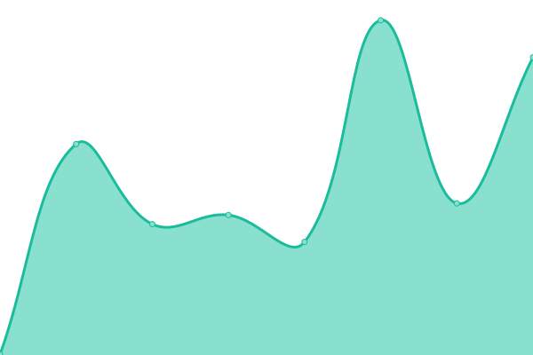
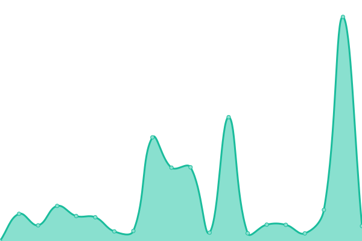
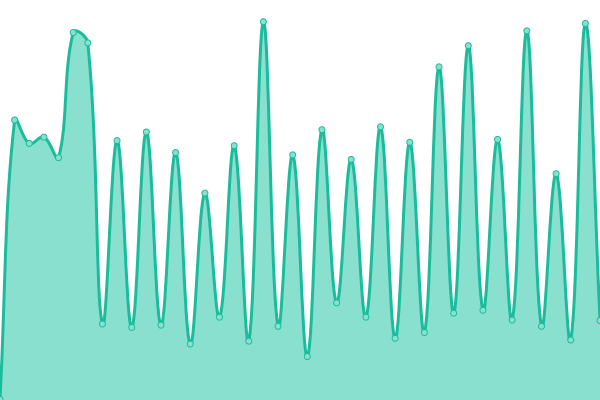
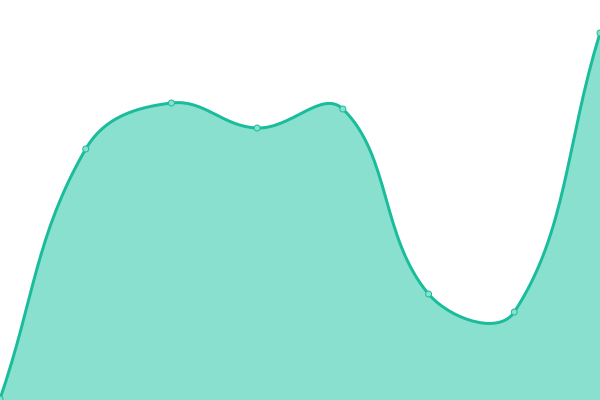

# [📈 Live Status](https://uptime.h4rs.site): <!--live status--> **🟧 Partial outage**

This repository contains the open-source uptime monitor and status page for [Hoàng Phi Hùng](https://uptime.h4rs.site), powered by [Upptime](https://github.com/upptime/upptime).

With [Upptime](https://upptime.js.org), you can get your own unlimited and free uptime monitor and status page, powered entirely by a GitHub repository. We use [Issues](https://github.com/hung319/uptime/issues) as incident reports, [Actions](https://github.com/hung319/uptime/actions) as uptime monitors, and [Pages](https://uptime.h4rs.site) for the status page.

<!--start: status pages-->
<!-- This summary is generated by Upptime (https://github.com/upptime/upptime) -->
<!-- Do not edit this manually, your changes will be overwritten -->
<!-- prettier-ignore -->
| URL | Status | History | Response Time | Uptime |
| --- | ------ | ------- | ------------- | ------ |
|  [Kotatsu](https://kotatsu.app) | 🟩 Up | [kotatsu.yml](https://github.com/hung319/uptime/commits/HEAD/history/kotatsu.yml) | 

 249ms
     
 | 

<a href="https://uptime.h4rs.site/history/kotatsu">100.00%</a>
    

|  [sync.kotatsu.app](https://sync.kotatsu.app) | 🟩 Up | [sync-kotatsu-app.yml](https://github.com/hung319/uptime/commits/HEAD/history/sync-kotatsu-app.yml) | 

 7621ms
     
 | 

<a href="https://uptime.h4rs.site/history/sync-kotatsu-app">95.23%</a>
    

|  [moe.shirizu.org](https://moe.shirizu.org) | 🟥 Down | [moe-shirizu-org.yml](https://github.com/hung319/uptime/commits/HEAD/history/moe-shirizu-org.yml) | 

 0ms
     
 | 

<a href="https://uptime.h4rs.site/history/moe-shirizu-org">0.00%</a>
    

|  [54.254.71.100](http://54.254.71.100) | 🟥 Down | [54-254-71-100.yml](https://github.com/hung319/uptime/commits/HEAD/history/54-254-71-100.yml) | 

 0ms
     
 | 

<a href="https://uptime.h4rs.site/history/54-254-71-100">0.00%</a>
    

|  [86.57.183.214:8081](http://86.57.183.214:8081) | 🟥 Down | [86-57-183-214-8081.yml](https://github.com/hung319/uptime/commits/HEAD/history/86-57-183-214-8081.yml) | 

 0ms
     
 | 

<a href="https://uptime.h4rs.site/history/86-57-183-214-8081">0.00%</a>
    

|  [kosync.estebiu.com](https://kosync.estebiu.com) | 🟩 Up | [kosync-estebiu-com.yml](https://github.com/hung319/uptime/commits/HEAD/history/kosync-estebiu-com.yml) | 

 416ms
     
 | 

<a href="https://uptime.h4rs.site/history/kosync-estebiu-com">100.00%</a>
    

|  [kotync.013666.xyz](https://kotync.013666.xyz) | 🟩 Up | [kotync-013666-xyz.yml](https://github.com/hung319/uptime/commits/HEAD/history/kotync-013666-xyz.yml) | 

 97ms
     
 | 

<a href="https://uptime.h4rs.site/history/kotync-013666-xyz">99.75%</a>
    

<!--end: status pages-->

[**Visit our status website →**](https://uptime.h4rs.site)

## 📄 License

- Powered by: [Upptime](https://github.com/upptime/upptime)
- Code: [MIT](./LICENSE) © [Anand Chowdhary](https://anandchowdhary.com), supported by [Pabio](https://pabio.com)
- Data in the `./history` directory: [Open Database License](https://opendatacommons.org/licenses/odbl/1-0/)
